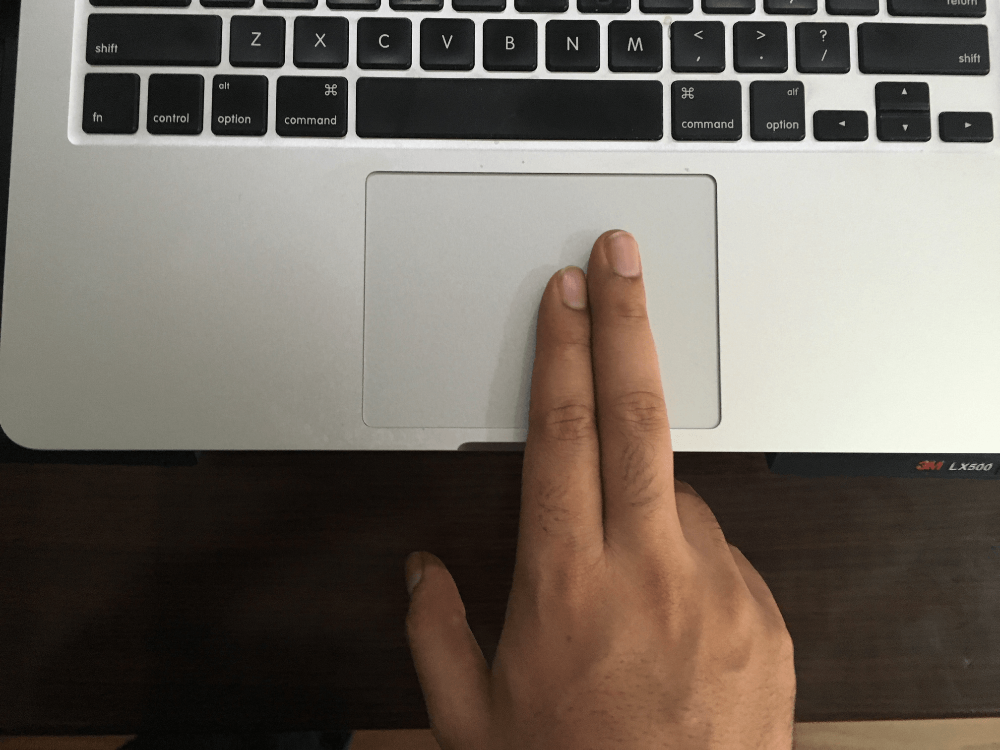

<figure>
	
</figure>

Back in 2007, I was so mesmerised by the two finger scroll that extensively started using it. It was revolutionary in 
way, to not find the scroll bar not search for the arrow keys. Just scroll when you need to; using any of your two damn 
fingers.

Although very useful it eventually greatly contributed to my RSI injury. It became so severe that I had to give up using the 
trackpad or mouse using my right hand. A year of using the mouse left handed and switching in between as needed, 
I was dealing with the pain now on both hands! The usual route of doctor, exercise and regularly taking break was great 
help. But what I really needed was a more efficient way to work. I thought to myself how can I completely avoid the mouse, 
I had used Vim earlier but never seriously as an IDE 
([Integrated Development Environment](https://en.wikipedia.org/wiki/Integrated_development_environment)). 
Then I discovered there a lot of people using it, but it needed a lot of configuration. [And
so I configured my version](http://vishesh.space/vim-as-an-ide-with-grails/).

I was on the Vim as an IDE bandwagon and hate the mouse now. But now I had another problem. Building this perfect Vim recipe was 
tedious and a lot of work. There were a lot of times when I just missed the IDE. The aha moment when I realized, let me 
look if there is a vim mode in the IDE. And there it was the [IdeaVim plugin](https://github.com/JetBrains/ideavim).
This neat little plugin was just what I was looking for. With all the IDE features and navigating using keyboard while editing 
it, I had my perfect tool.
 
I had tasted blood and now wanted to see if I could replicate the solution for the next tool I used the most the browser.
To my astonishment, I was able to find an extension on chrome, [cVim](https://chrome.google.com/webstore/detail/cvim/ihlenndgcmojhcghmfjfneahoeklbjjh?hl=en) 
which would allow me to navigate using keyboard in Chrome as well!

This setup is so sweet and now I dread the thought if I every have to leave the keyboard :) ... If you have an RSI story 
do share as comments, would love to hear what you did to deal with it. 

 
 

