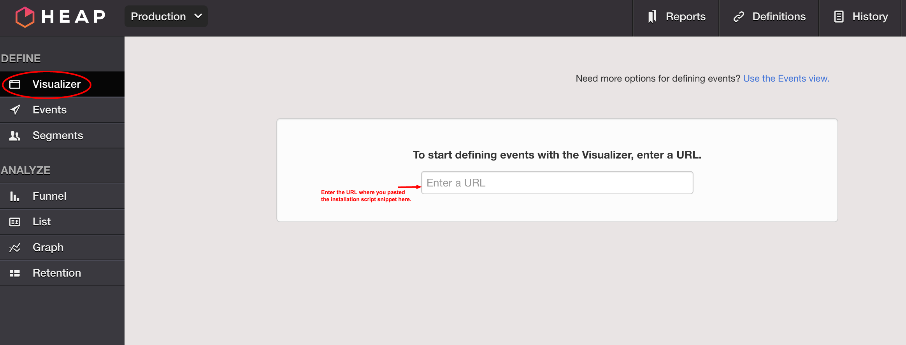
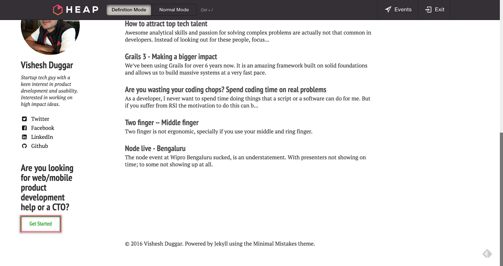
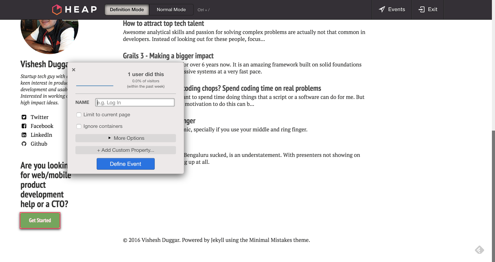
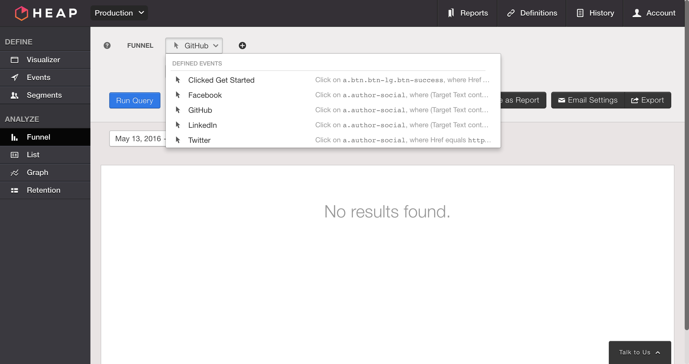

<figure>
	
</figure>

If you're a preliminary Google Analytics users you will love this. In fact, you might even question why is Google 
Analytics still such a crap product.

There are many alternatives out there with Mixpanel, Kissmetrics and Heap Analytics.  

With Heap, the biggest win for me is you don't really need to code to define an event. You simply use their visualizer to open 
your page and define any went on any element on your page.

Let's look at how easy it is to set up.

## 1. Sign up

## 2. To get started with Heap, paste the code snippet given to you after signup to your website's closing </head> tag:
It should look something like this.




## 3. Use their visualizer to actually go to your site and define events.
<figure>
	
</figure>

## 4. On your site select the element you want to add the event to
<figure>
	
</figure>

## 5. Define the event
<figure>
	
</figure>

## 6. Done and you can now analyze the funnel. It is really that simple. 
<figure>
	
</figure>

Especially if you want to test out something new and validate things, this is great.

## Nerd talk
No more adding Javascript for event definition. Granted it uses CSS selectors which might break if there are changes in
those. But for startups that want to move fast; Heap's simple approach to defining events is priceless.

I am excited about the possibilities and eager to know how it will perform as a tool at scale. If you have experience 
with  other tools or Heap. I would love to know about it.

Know more about how it compares with Google Analytics and others, [here](https://heapanalytics.com/compare/heap-vs-google-analytics).

