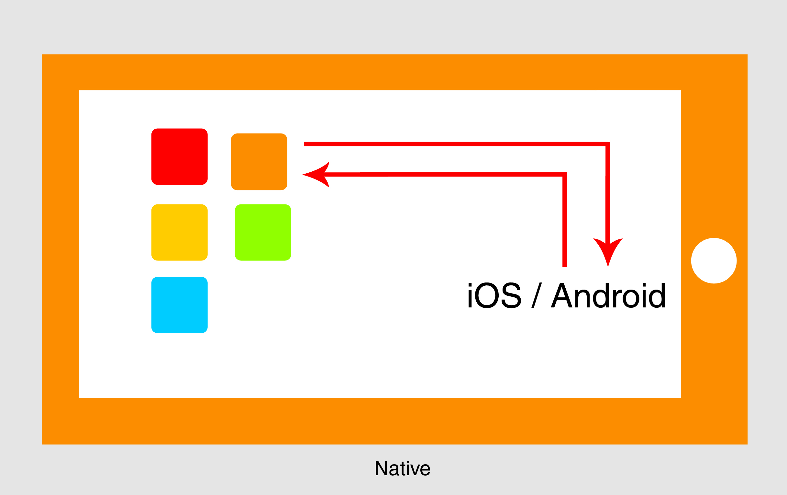
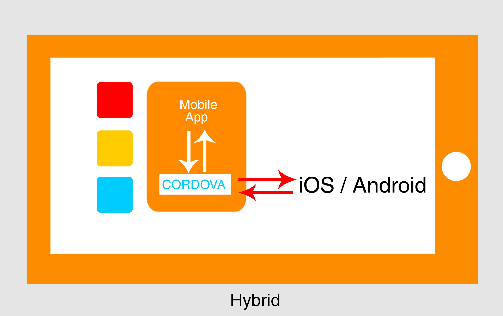

Every app has to interact with your device operating system to function. For example your app might need to get the current
location of the user.

This interaction can be done by either writing a program that operating system understands i.e. writing a native app

<figure>
	
</figure>

 
Or we can write an app talks to something say "X" and "X" talks to the operating system.

For example let's look at how one hybrid technology called Cordova, which is used to write hybrid apps using web
technologies like HTML, JavaScript and CSS.
<figure>
	
</figure>

The application actually makes a call to a component inside the app which in turn talks to the operating system.

At a high level you might think it makes more sense to write native apps but before making up your mind is read, 
[3 common misconceptions about hybrid apps?](http://vishesh.space/3-common-misconceptions-about-hybrid-apps/)