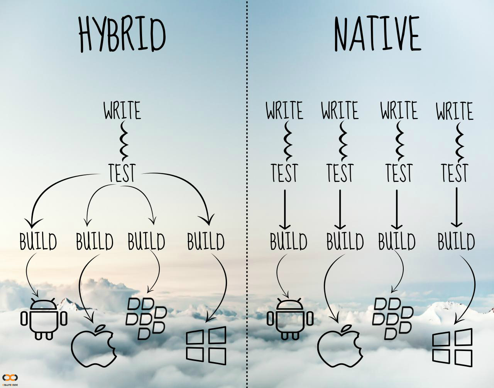

<figure>
	
</figure>

Hybrid apps interact with your mobile operating systems indirectly. [Read more about, what is a hybrid app?](http://vishesh.space/what-is-a-hybrid-app/)

Before you actually pick a route on which kind of app you want for your startup or product. Let's look at what a hybrid 
app brings to the table.

Proponents of native apps state the following advantages:
1. Device specific features like apps GPS camera etc
2. Performance
3. Better user experience

## Device specific features

There are hundreds of plugins available, many of which expose or give access to device specific hardware or features.
But even if you needed to use a feature that isn't. You couldn't simply write a plugin yourself or collaborate with someone to get that feature.
Here are a few key device-specific plug-ins out there:

1. [Cordova Core Plugins](https://cordova.apache.org/docs/en/latest/reference/cordova-plugin-battery-status/index.html).
 There is support for everything from Battery Status, Camera, Console, File API, Geolocation, Statusbar and more.
2. [PhoneGap Push Notifications Plugin](https://github.com/phonegap/phonegap-plugin-push)
3. [Custom URL scheme Cordova/PhoneGap Plugin](https://github.com/EddyVerbruggen/Custom-URL-scheme) 

### Performance
Gone are the days where you had to rely on slow CSS and JavaScript animations that were just not good enough,
with so many JS libraries out there that manipulate the view using what Dom CSS transformations are to achieve 60+ FPS

If you crave for that native kick for certain computations, nobody is stopping you to write parts of your app natively.
But native animation can no longer be held against hybrid tech.

### Better User Experience
Some say people are used to native UI elements. With frameworks like OnsenUI providing component library that look and feel native
you don't have to worry about the User Experience.

## But why is taking the hybrid route better for most organizations?

### 1. One team
If you use JavaScript/Typescript and other web technologies for both web and mobile app via hybrid tech,
the development costs can be brought down drastically. The key advantage is scaling the team, it becomes easier because as a team
 you don't have to train and on board people on 3 or 4 different technologies. This in many cases can be the difference
 between building an app in house vs. outsourcing things.

Essentially allowing you to maintain one team for multiple platforms and the web.

### 2. Launch faster and service your customers better
With a major part of the codebase being the same for iOS, Android, Windows and Web applications will allow you to fix bugs
faster. Have a much better automated test coverage. Lessons learned from one app will be applied to the other versions in
many cases without any additional work.

### 3. Access to talent
A lot of hybrid technology is built around JavaScript. It is much easier to find JavaScript developers than 
a Swift developer or an Android developer. Finding good developers is hard in general. Imagine if you were to build
a team of great engineers in Swift/Objective-C, Java and JavaScript just for mobile development as a startup or an 
organization trying to run lean.

It is a great time to be developing using hybrid app technology especially now. Launch faster, run leaner, grow your 
development team faster pick hybrid!

Would love to hear your experiences native or hybrid. 
