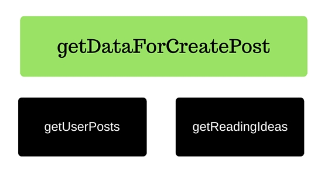

<figure>
	
</figure>

Wishful thinking is a programming practice where a programmer abstracts out all complexities.

As an entrepreneur when you are taking that leap towards a goal or strategy, a lot of times one has the urge to have 
as much implementation detail of each piece to feel comfortable sometimes that urge itself becomes a big barrier to start. 

Here is a simplified example of how a programmer might abstract some of the things if we were building the 
published post featured on LinkedIn.

<figure>
	
</figure>

Here I can abstract out most of the sub-problems and expand on the one. Once I am done with `getDataForCreatePost`, I can then move to 
implementing a solution for the next problem.
<figure>
	
</figure>

    PostService {
    
        def getUserPosts(User user) {
            return [];
        } 
                        
        def getReadingIdeas() {
            return [
                'Wishful thinking for entrepreneurs',
                'Introduction to Grails for Ruby On Rails developer',
                'Deming's Philosophy - Continuous Improvement'
            ]
        }
        
        def getDataForCreatePost() {
            return [ideas: getReadingIdeas(), userPosts: getUserPosts()];
        }
    }

In the above example, I have abstracted out `getUserPosts` and `getReadingIdeas` by simply
returning a fixed set of values (i.e. hard coded). I can now focus on implementing `getDataForCreatePost` 

Let's take a look at using `Wishful Thinking` applied to a business problem, "Making hiring inbound". Let's first divide
the problem into few sub-problems

1. Relevant technical blogs so developers can find us
2. How to videos
3. Interesting programming challenges for developers to solve and submit for being considered for engineering roles

I can abstract or stub out most of these and then expand on one. For example:

1. Source relevant technical articles by others, to share on company LinkedIn page
2. Source "How To" videos to share on all our social channels
3. Provide a link to a public Google spreadsheet with a list of challenges developers can play with

Now all these abstracted/stubbed out solutions don't really solve the problem completely but get us somewhere closer.

Now I can pick one of the above sub-problem that is a higher priority and dive into breaking it down further.

If you practice [Lean Startup](!http://theleanstartup.com/principles) some of this might sound familiar. When building 
a Concierge MVP you will really need to bring your "A" game in abstraction.

Would love to hear your experiences using brain tricks to move faster. 

