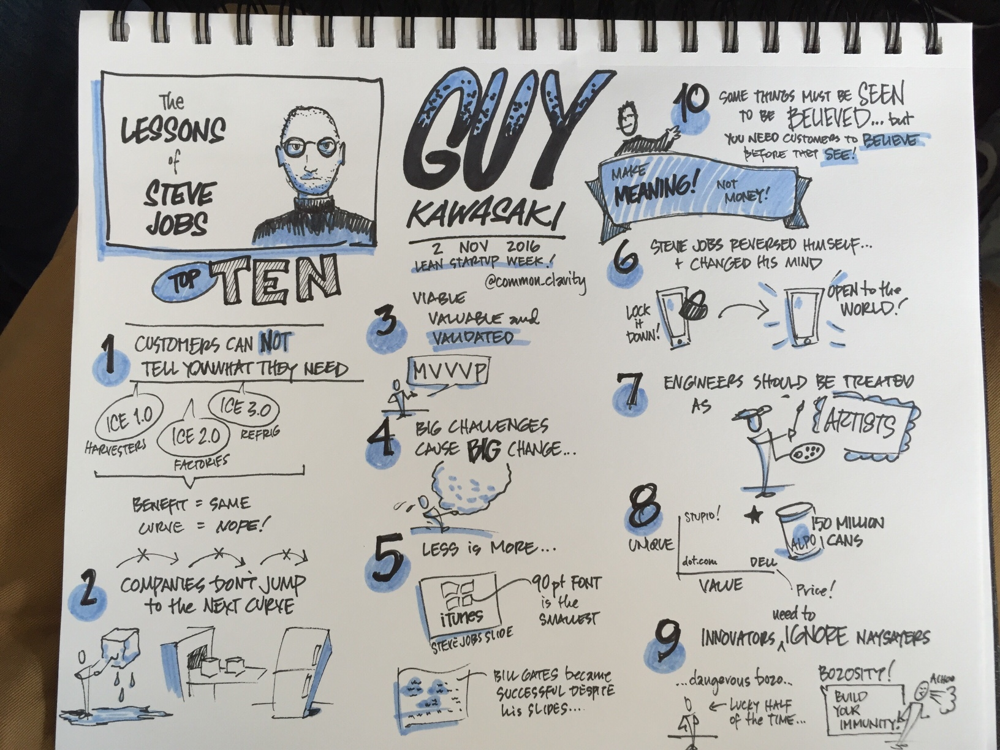
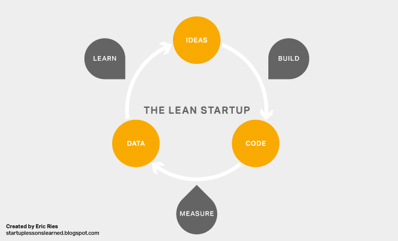
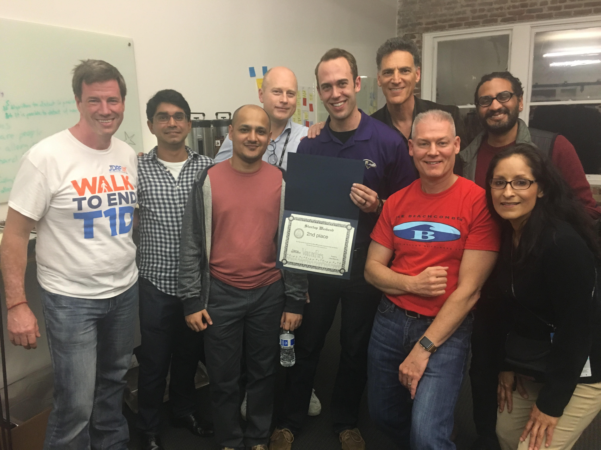

9 important lessons from the Lean Startup Week 2016 San Francisco

I was at the lean Startup week 2016 in San Francisco couple of weeks ago. 
It is a great conference to meet entrepreneurs and innovation teams at other enterprises. 
Here are some of the key lessons I learned at the conference.

## 1. WOM > PROM
Word-of-mouth growth should be greater than promotional growth.

To attract investment or of VC money  your product needs to be good enough 
to have WOM greater than PROM. David Bennett spoke about how you can use WOM
growth curve to decide when to invest more in promotions. He is a phenomenal speaker on lean. 
If you get a chance to hear him talk do not miss it.

## 2. Innovation = Ideation + Implementation
You don't have to be the fastest, you just need to be faster than your 
competition. David with Jonathan Bertfield spoke about how enterprises
need to using McKinsey's 3 Horizon Model continue investing in innovation
while continuing to grow their existing business.

* Horizon 1 - Core business
* Horizon 2 - Emerging opportunities
* Horizon 3 - New ideas and innovation

The split in investment the speakers recommend:
<figure>
	
</figure>

More on what each horizon means [here](http://www.mckinsey.com/business-functions/strategy-and-corporate-finance/our-insights/enduring-ideas-the-three-horizons-of-growth)

## 3. 10 lessons from Steve jobs by Guy Kawasaki
Here is an amazing illustration by an unknown attendee

<figure>
	
</figure>

## 4. Your company needs to be your best product
Basecamp founder Jason Fried truly believes in this. Hearing him speak 
over the years I realized at the event how well he has been able to 
execute on this and how every company should.

## 5. Reduce customer anxiety and shorten your sales funnel 
The best sales funnel isn't really a fun and it's a flat circular ring. - SC Moatti. 
You can come closer to achieving it, if you can help alleviate some of 
the customer anxiety leading up to the sale.

And there is a sense of anxiety when making purchasing decisions arising 
from fear of missing out on a better product, paying the right price, 
future costs et cetera.

## 6.  Understanding behavior change
Changing the behavior of your customers, leads, team members can have a 
profound impact on your business. One needs to understand some of the 
science behind it and be more observant. 

 Kelvin Kwong gave a few examples: the endowed progress effect. When we see some progress even if it is 
 artificial we want to achieve that goal faster.

 A few more that you should read on include <a href="https://en.wikipedia.org/wiki/Reactance_(psychology)" target="_blank">Reactance</a>, 
 <a href="http://alexwhite.org/2011/03/facebook-likes-and-the-commitment-and-consistency-principle/" target="_blank">Commitment and 
 Consistency</a>, <a href="http://changingminds.org/techniques/general/sequential/fitd.htm" target="_blank"> Foot in the door </a>, 
 <a href="http://changingminds.org/explanations/theories/goals.htm" target="_blank">Goal setting</a>, 
 and <a href="http://changingminds.org/disciplines/game_design/principles/winning.htm" target="_blank">appropriate competition</a>

## 7.  Don't propose our first date. Sales pitch should be like a proposal
Just because your target market wants what you offer and then know about 
you; don't start selling. Ryan Deiss, at a partner event Weapons of Mass Distribution at 500Startups, 
blew our minds away with this simple truth about sales.

Spend lots of time together with your target market via blog conversations 
and helping them with other pressing problems they have by providing 
smaller tools and guides.  fall in love before proposing !

## 8. Language drives the product. Make it about the customer and not about you
Before building a new product find out the space you want to be in.  
Formulate  problems in that space. Talk to potential customers to find 
out what they want. Build the product based on your findings and use the 
language they used to sell it. 

This was James Currier from NFX Guild. It was pretty cool to see his work 
that resulted from practicing the above!

## 9.  Customer interviews are critical to increasing your odds at building a successful product

A lot of us have been practicing lean or at least trying to practice 
with the recommended mindset of:
Build Measure Learn Loop
<figure>
	
</figure>

But after hearing Justin Wilcox at the Startup weekend talk about 
customer interviews, I really think it should be called the Lean Measure Build Loop.

While at the Startup Weekend and I joined a team working in the food space.
Before building anything we used Justin's simple customer interview 
template to talk to few of our potential customers. 

Justin's template 

1. What’s the hardest part about      [problem context]    ?
2. Can you tell me about the last time that happened?
3. Why was that hard?
4. What, if anything, have you done to solve that problem?
5. What don’t you love about the solutions you’ve tried?

You can read more on Customer Development on his [blog](http://customerdevlabs.com/2016/11/14/biggest-customer-interviewing-mistake/).

The beauty of this approach is once you zero in on a space you want to be in, if you do the interviews right the customers will tell you what the product should be and how and where to sell it.

Once you have that you need to go and sell it before even building it.  And when you have people interested in buying it you can then build it.

While a lot of our potential customers didn't really need what we were
trying to build. We learnt what they actually wanted by putting most of
the effort in customer interviews during the weekend. And saved a ton of 
time on NOT building something nobody wanted.

While doing interviews
a. Don't about your idea
b. If they ask about it before the interview, politely tell ask them to 
wait till after it, to help avoid any bias

Even though we couldn't validate the idea to a great extend, we won the 2nd place!
<figure>
	
</figure>

It really was a long conference with tons of useful information and great 
people to connect with. If you are also attending please share other key 
lessons that you learned as comments. There is also detailed notes on 
talks by attendees [here](http://bit.ly/leanstartupweek2016)