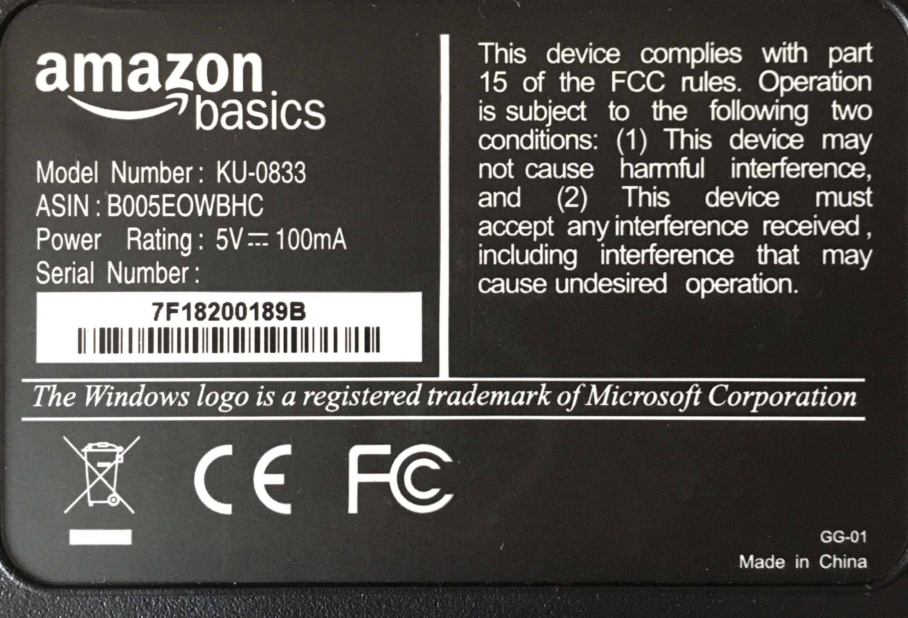

A couple of weeks ago while unpacking things I brought back from work as I set up my home office for the few weeks of self-quarantine ahead of us. I'm looking at the keyboard or rather the back of the keyboard and I see this. It was a trademark notice notifying users about the Windows key. See picture below:

<figure>
  
</figure>

I wonder how many keyboard Manufacturers across the globe print this notice. In 2018 the turnover in the computer keyboard market was projected to be 13.7 billion U.S. Dollars and [next year it is expected to hit 14.9 billion](https://www.statista.com/forecasts/965285/pc-keyboard-revenue-in-the-world). With a market share of [88%  for Microsoft Windows operating system](https://netmarketshare.com/operating-system-market-share.aspx?options=%7B%22filter%22%3A%7B%22%24and%22%3A%5B%7B%22deviceType%22%3A%7B%22%24in%22%3A%5B%22Desktop%2Flaptop%22%5D%7D%7D%5D%7D%2C%22dateLabel%22%3A%22Trend%22%2C%22attributes%22%3A%22share%22%2C%22group%22%3A%22platform%22%2C%22sort%22%3A%7B%22share%22%3A-1%7D%2C%22id%22%3A%22platformsDesktop%22%2C%22dateInterval%22%3A%22Monthly%22%2C%22dateStart%22%3A%222019-03%22%2C%22dateEnd%22%3A%222020-02%22%2C%22segments%22%3A%22-1000%22%7D). It's safe to assume that's a lot of energy and time spent.

I understand that they need to protect the brand but I think the intent of organizations using Microsoft’s logo on the keyboard should be fairly obvious. They can eliminate this by giving blanket permission for people to use the Windows logo for a Windows key for any keyboard design for a Windows PC.

The larger question is are brands willing to take a hard look at what different then merchandise. And eliminate unnecessary things that don’t benefit anyone adds no value whatsoever to the business and is useless legally.

Are there brands you come across that a good job act responsibly printing their label?

