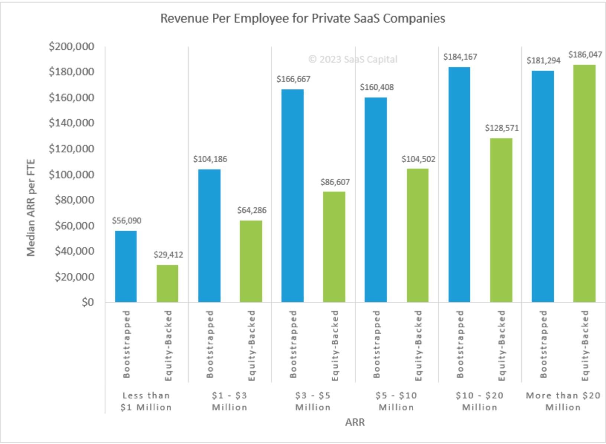

<figure>
  
</figure>
<small>Data from [SaaS Capital](https://www.saas-capital.com/blog-posts/revenue-per-employee-benchmarks-for-private-saas-companies/)</small>

With each stage of growth comes a set of challenges and decisions that can determine the venture's fate. One such critical decision centres around scaling. When and how to expand the team. While hiring is often seen as a direct response to increased workload or an avenue to expedite projects, it's a nuanced operation that goes beyond filling vacant seats. Every addition to the team can either propel a startup closer to its mission or set it on a trajectory towards inefficiency, bloat, and, eventually, stagnation. 

## Why Companies Hire?
Companies hire to deliver faster on a roadmap or customers. As they try to push the limit of what they can do teams feel the pressure and their capacity is tested pushing them towards creating a new role.

During early growth, you'll encounter milestones that highlight the need to infuse additional skill sets into the team requiring you to create a headcount.

Some early-stage founders equate growth to headcount. There are several reasons why headcount gets created.

The growth phase in an early-stage startup is exciting. Rapid headcount growth can seem like an obvious strategy. More hands on deck would presumably mean more work done, right? However, this logic can be misleading and potentially detrimental.

1. More Communication Lines, Often Leading to Inefficiencies:
The beauty of a small team lies in its cohesiveness and seamless communication. As the team grows, so does the network of communication channels. Each new member adds to this complexity. Leading to misunderstandings, conflicts, or missed opportunities. Information might not flow as freely or as rapidly, resulting in delays and errors that weren't present before. Entangling the company in the web of its own making.

2. Decline in Revenue per FTE, a Warning Sign of Looming Inefficiency:
Another subtle yet alarming danger of unchecked headcount growth is the decline in revenue per Full-Time Equivalent (FTE). While at first glance, hiring seems like a solution to meet growing demand or complexity. It is vital to assess its impact on the bottom line. Declining revenue per FTE is often a sign suggesting a move towards inefficiency. 

## Losing speed could cost you your startup
In essence, while growing a team is a natural step in a startup's journey, it demands careful planning and strategic thinking. A thoughtless surge in headcount can inadvertently slow down a startup, distancing it from its goals and vision.

One key advantage of a startup is its speed. You want to ensure as a founding team you don't scale the team to a headcount and structure pushing them towards inefficiency and bloat.

## Practical steps to keeping hiring in check

### 1. Balanced Team Composition
Someone seasoned with experience and expertise in a set of things can do wonders to the level of execution.

However, deploying too many specialists can backfire. If you have specialised teams doing piece(s) of a project it introduces hand-offs that can slow things down significantly. And if you have too many specialists in one it can result in having too many chefs in a kitchen -- chaos is likely with each expert pulling in their own direction.

This can also result in a steep dive in revenue per FTE as specialists don't come cheap.

It's about recognizing the areas where expertise is paramount and aligning specialists accordingly. Conversely, in areas where adaptability and breadth of knowledge are more valuable, generalists should be the backbone. This balance ensures both depth and versatility in a team, optimizing for growth and innovation.

### 2. Monitoring Revenue Per FTE
An early indicator of the financial health of the company. Downward trend on this coupled with continued hiring - you are clearly hiring aggressively. it needs to be a risk that you are aware of or are willingly taking. 
   
### 3. Revisiting Pricing 
It is common to get the pricing wrong. One fix to improve revenue per FTE is to revisit the value delivered, ROI and your pricing. There are many strategies to renegotiate pricing with existing customers like adding new product features or categories, un-bundling a product area as a separate product, major upgrade as a new product and more.

### 4. Letting customers go
Evaluating which customers are costing you the most and are not profitable. Letting those customers go can drive down support costs and improve revenue per FTE.
   
### 5. The Power of Saying No
Many startups think they have to say yes to closing sales. The simpler thing to do is to build something of value - by talking to enough customers and then selling that. If you consistently need to say yes to things that are not part of your standard offering; you don't have a product-market fit yet. Or you are selling to everyone under the sun instead of focusing on selling to your ICP.

Once you stop saying yes. The pace of resource-intensive new features or projects can slow down. Reversing the downward trend in revenue per FTE.

## Conclusion
A few years of VC-backed startups demoing exponential growth with no sight of profitability and continuing for a while has set a bad culture. But the market is course correcting. To adapt to these new conditions keeping an eye on revenue per employee is critical.

What hacks or suggestions would you add that could improve revenue per employee?
