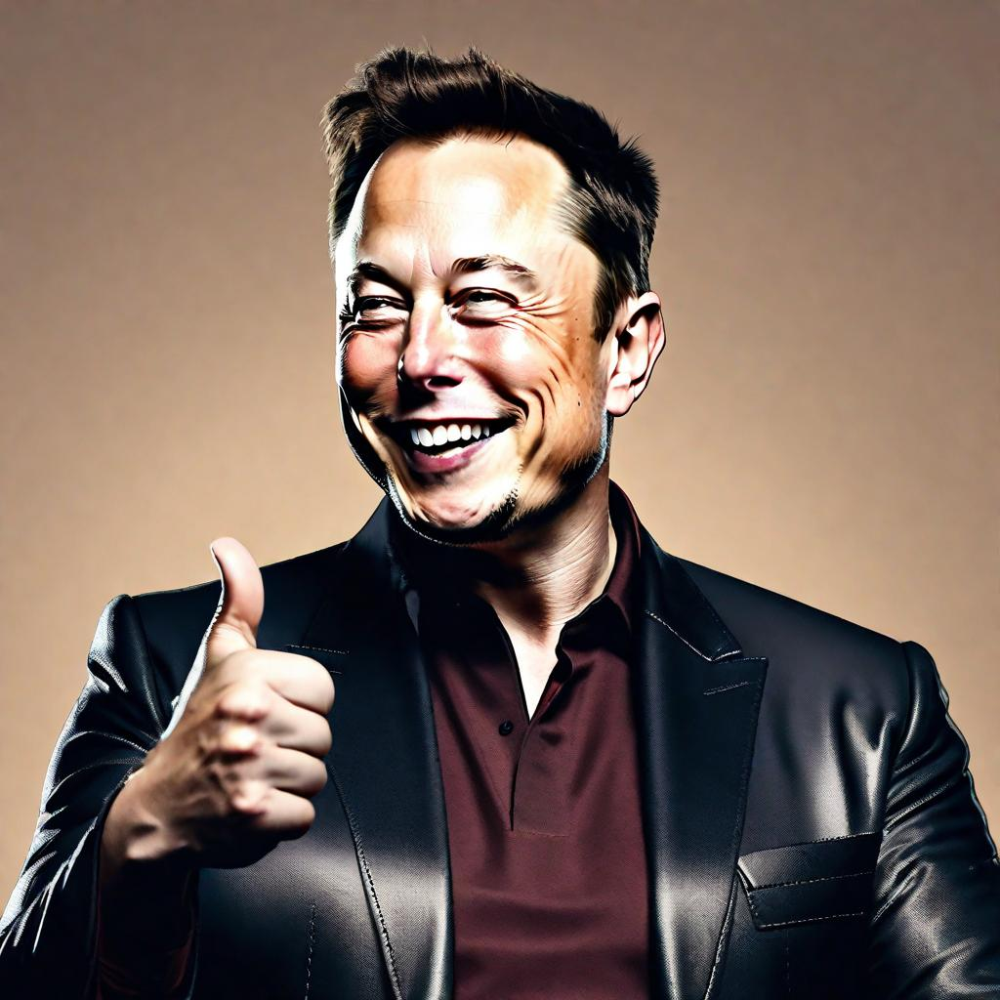

<figure>
  
</figure>

The difference between success and stagnation lies in the approach we take to solve problems.

Every entrepreneur aspires to innovate, break boundaries, and redefine industries. Today, we draw inspiration from a man who's done it all: Elon Musk. 

Beyond electric cars and rockets, Musk has gifted us with an algorithm. Using this algorithm -  They drove the "per kilogram cost" of a Falcon 9 launch to $1520. It is simple yet can transform the way you think about your business.

## Elon's Five Commandments

From his experiences in the Nevada and Fremont factories, Musk developed a five-step approach:

### 1. Know your requirements
  Every requirement should come from a person. It shouldn't be a faceless requirement from a department. Musk says requirements from intelligent people are the most treacherous. The solution? Question them. 

  A valued customer once requested a high-tech text extraction feature for pulling formulas from PDFs, a task with a potential $500k price tag. Upon discussing the real need behind this request, we collectively realized it wasn't essential after all.

  What requirements in your business have you accepted without question?

### 2. Delete with rigour
  Musk and SpaceX achieved an unheard level of efficiency by deleting processes or requirements they were unsure of. If you don't end up adding back at least 10% of what you removed, then you've been too lenient.

### 3. Simplicity & Optimization
   Before jumping into refining a process, ensure it's even necessary in the first place. Musk learned the hard way that many times, we end up fine-tuning something that shouldn't exist at all. Be thorough.

### 4. Boost Your Cycle Time
   Musk believes that every process has room for acceleration. However, this step is essential to be taken after the first three. There's no point in speeding up a process that's redundant or hasn't been refined.

### 5. Automation is the Final Frontier
   While automation is tempting (and certainly the future), it's the final step in Musk's algorithm. He admits to prematurely automating steps in the past. Remember, you can't set things in 'automatic mode' until you're entirely sure about what's being automated.

## Summary
For the founders facing the funding winter - a winter looking graver than the one from Game of Thrones. Musk's algorithm isn't just a business strategy; it's a philosophy. 

By adopting and internalizing these five commandments, not only can you make smarter decisions for your enterprise, but you also build a resilient foundation that withstands the test of time. In the words of Musk himself, repeat this algorithm to an "annoying degree."  