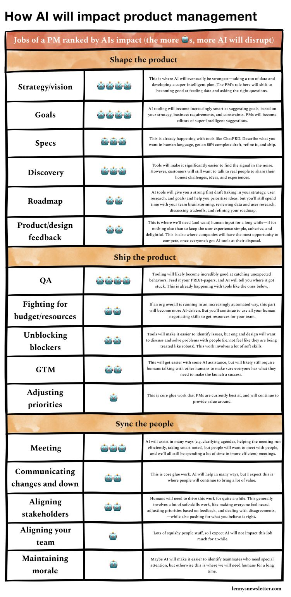

<figure>
  
  	<figcaption><a href="https://www.lennysnewsletter.com/p/how-ai-will-impact-product-management" title="How AI will impact product management - By Lenny Rachitsky.">How AI will impact product management - By Lenny Rachitsky</a>.</figcaption>
</figure>

The ego has landed.

And why you can finally be proud of it!

There are a lot of tasks where AI will replace us. 
Attached is a neat list from Lenny Rachitsky's latest blog just on product management alone.

In the digital age where AI can write novels, solve complex equations, and strategy 🙄, there’s one frontier they haven’t conquered: 

The almighty human ego. 

Yes, that wonderful sense of self-importance that makes us argue over the internet, buy things we don’t need to impress people we don’t like, and generally believe we’re the main characters in the movie of life.

Only humans can craft insults so creative that they become compliments. AI can try to keep up, but "Your motherboard is so outdated it belongs in a museum" doesn’t quite sting the same.

So, can AI develop an ego? 

Maybe, if we start programming them to have existential crises, care about fashion, and argue on Twitter. But until an AI sulks, because another AI got a software update before it did, this is unique to us.

Why is ego important, you ask? 

It pushes us to confront our fears. And drives innovation, competition, and occasionally, regrettable fashion choices. 

Zuckerberg's ego took a hit harder than a Nokia phone because of the social awkwardness and rejections at school. Which eventually led to the building of Facebook. 

Remember, next time AI outsmarts you, at least you can take solace in the fact that it doesn’t know the satisfaction of buying a ridiculously overpriced latte just for the ’gram. 

#EgoWins